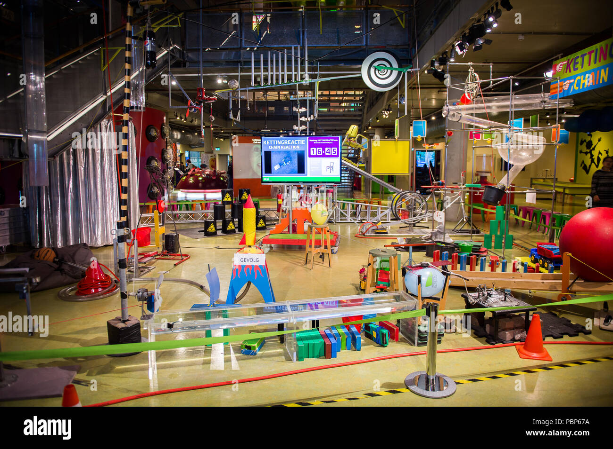

I recently visited Amsterdam with my family. At Amsterdam there is a science museum called NEMO. It's specifically for children to learn about science. There were all sorts of experiments and contraptions the kids could interact with, from electricity, to sound, motion, pulleys and more.

But one of the exhibitions caught my eye: **The Chain Reaction** 

The "Chain Reaction" is a scheduled live demonstration/show at NEMO that explores the principles of cause & effect, and potential and kinetic energy.

- It features large-scale contraptions and setups (dominoes, rolling chairs, seesaws, flying cars, etc) showing how one action triggers the next.
  Wikipedia

This exhibition took me back to the 90s as a kid, playing the old game: **Incredible Machine**:

This is a classic contraption puzzle where things like a hamster/mouse wheel, ropes, pulleys, fans, etc. trigger chain reactions. We built all sorts of funny contraptions just like the one at NEMO as a kid, we could play this for hours, everybody tried to incorporate everything they could into their contraptions, it was amazing fun.

Through the eyes of a child, the chain reaction is very captivating, the kids try and imagine just how this thing is going to well, and how _Incredible_ it will be.

But unfortunately for me I'm no longer a kid, and when I looked at this contraption, I saw this thing through the eyes of an engineer, a **DevOps** engineer. I know from real-life experience these sorts of contraptions, are not ideal from an operations support POV. The issue lies in the fact that if anyone of these sub-systems breaks, then the whole reaction will no longer work. In real life, real physical systems do not behave like they do on the computer. In the _Incredible Machine_, when you ran your reaction, the behavior was exactly the same each time, but in real-life this is rarely the case.

The whole exhibition was one long Series Chain System Structure:

## System Structure

| **System Structure**     | **Formula**                                      | **Effect**                            | **Engineering Example**                              |
| ------------------------ | ------------------------------------------------ | ------------------------------------- | ---------------------------------------------------- |
| **Series (Chain)**       | $$(R = R_1 \times R_2 \times \dots \times R_n)$$ | Reliability decreases as chain grows  | API call chain (Auth → Service A → Service B → DB)   |
| **Parallel (Redundant)** | $$(R = 1 - \prod(1 - R_i))$$                     | Reliability increases with redundancy | Load-balanced servers, RAID storage                  |
| **Hybrid**               | Mix of both                                      | Balance of fragility and resilience   | Microservices with retries, caches, circuit breakers |

## Game time

I placed my bets! I told my wife I predict this thing won't work flawlessly, that something will break. Over time each of these systems may be slowly becoming less reliable. But lets say for argument sake there are 100 sub-systems, and each one fails every 200 attempts. That means:

$$ (1 - \frac{1}{1000})^{200} = 0.606 $$

Which means a $$60.6\%$$ chance of success. But hey, I'm pessimistic.

## Chain Reaction Start

The host searched for a volunteer child, there were no shortages. One girl was eventually selected. She was given a helmet👷‍♀️ to wear (safety first) given way too mich instructions for a small task but anyway eventually she started the reaction. And off went all the contraptions, a flame 🔥 turns on, and cuts a rope , a toy 🚗 crashes into something, a 🎱 ball rolls down something etc. I honestly couldn't recite anything near the actual order, it's overwhelming all the different objects and motions.

But eventually the experiment got to a hammer, which swang down to cut a rope of some sort of suspended mass so it could fall. But instead of the rope allowing the object overhead to free fall, it gets caught on the hammer 🔨 wrapping around it, stopping the experiment.

## Missed Opportunity for Learning

When things go wrong this is the best learning I've found. Things going right in tech don't really teach you anything. Everything works till it doesn't. Yes sure there was a fault in the reaction, and our instinct is to jump on to the issue and fix it. Just like bugs 🐞 is Software. But often a bug should not disrupt an entire process/transaction. It's sometimes better to ask why any sort of problem, is so decremental to the system, and how it could be made more resilient as a whole. And unfortunately the reliability of this system is not really anything to do with one bug, but more the structure of the system.

## How to Mitigate

We are always constrained when developing technical solutions, whilst running everything with a redundant parallel experiment might theoretically seem like a good idea, it's not really an option. Instead the technician provided redundancy, manually starting the next link. There are other patterns though which may be applicable, such as retry, which reminds me of a Queue-Consumer scenario. As I write this I see that I am worried I am seeing the world in Software Components 😕.

```mermaid
flowchart LR
    A[Start Request] --> B[Attempt 1]
    B -->|Success| G[Success]
    B -->|Fail| C[Retry 1]
    C -->|Success| G
    C -->|Fail| D[Retry 2]
    D -->|Success| G
    D -->|Fail| E[Failure after max retries]
```

### Where to from here

In the future I predict we will start to see the structure of these solutions in the tech world driven by LLMs. What is meant by _Reliability_ will be more and more hard to define, and will be disconnected from the logical flow of code, or the cause and effect in a chain reaction not too unlike that of what was at NEMO.
