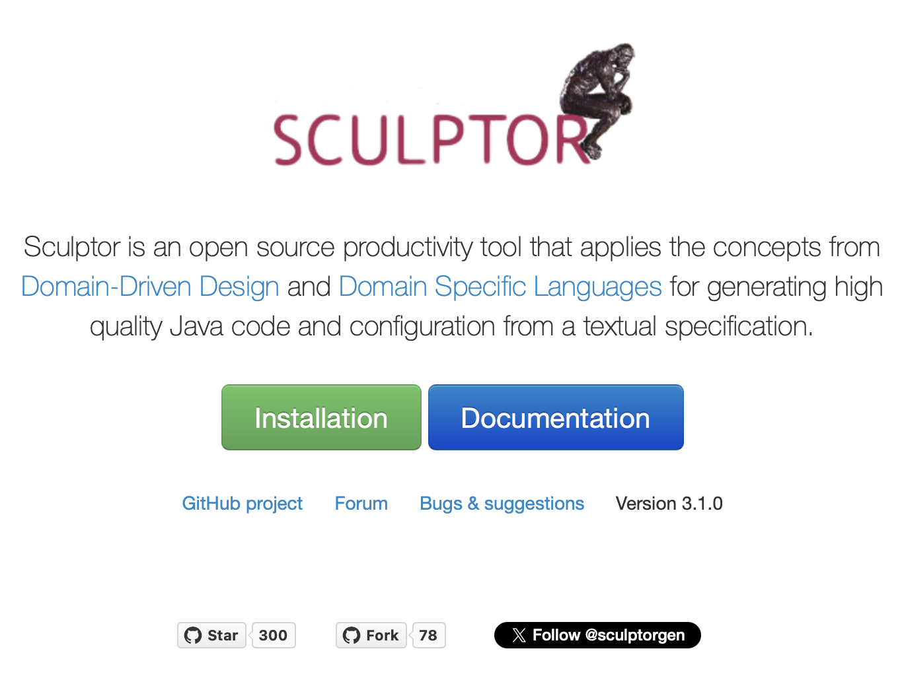

## What is is

Right now there is a massive race to find higher level abstractions/languages to reliability communicate intent with LLMs. Amazon recently came out with [kiro] (https://kiro.dev/), an IDE built around this concept of Spec Driven Development. Developers can then communicate what they want to achieve, and how a feature is supposed to behave, but not have to actually do the coding.

## Why is it becoming popular

Spec driven development is a way to constrain the

Coding is becoming more and more a game for AI to build, but

When we look at all the aspects of software development, one thing missing in all of this is a good understanding of the domain. Thereare

## What is missing

One key issue I feel with SDD, is there is no emphasis on the Domain. Before

## How can this gap be included.

It's hard to find a good DSL for DDD. This search took me to some funny locations, one of which being eclipse, the lost land of JavaEE. JavaEE lived in a time of waterfall, where specs and modelling were done a lot up-front before building. What I realized in this search was that modelling at a high level had a few different flavours:

### Domain Driven Design

There was designing the domain at a high level for the purpose of ..

### Application Templating

Generating the fundemental Application framework from the

### [Sculptor](https://sculptor.github.io/)

This tool was so old school:



Sculptor had `.btdesign` file

:::tip Prompt
perform Domain Driven Design using sculptor: https://sculptor.github.io/ for a petstore. Focus on the domain of the actual pet housed at the petshop, such as dogs and cats.
:::

:::info Answer

Awesome—here’s a Sculptor-style domain model focused purely on the animals actually housed in a pet shop (dogs & cats). You can drop this into a model-pethousing.btdesign and use it as your starting point.

> Note: Context Mapper’s tactic DDD syntax is based on the Sculptor DSL, so if you use Context Mapper instead, this will feel very familiar.
> Context Mapper
>
> Sculptor itself is the OSS DSL/codegen tool this targets.

```java
Application Petstore {
  basePackage = com.example.petstore
  doc = "Domain for animals physically housed in the shop: intake, housing, care, and adoption readiness."

  BoundedContext PetHousing {
    doc = "Everything about animals in-house (dogs & cats), their kennels, care, and adoption lifecycle."

    // === Shared definitions ===
    Enum Species { DOG, CAT }
    Enum Sex { MALE, FEMALE, UNKNOWN }
    // ...

    ValueObject Microchip {
      String number
      doc = "Global unique microchip number; may be absent for some intakes."
      constraint unique(number)
    }

    ValueObject Name {
      String callName
      String pedigreeName optional
    }

    ValueObject WeightKg {
      BigDecimal value
      constraint range(value, 0.1, 200.0)
    }
    // ....

}

```

:::

## JHipster

The other tool I came across was JHipster

:::tip Prompt
perform Domain Driven Design using JTL https://www.jhipster.tech/jdl-studio/ for a petstore. Focus on the domain of the actual pet housed at the petshop, such as dogs and cats.
:::

:::info Answer

```java

/**
* Petstore — Pets Domain (DDD-flavoured) in JHipster JDL
* Focus: animals housed at the pet shop/shelter (dogs, cats, etc.)
* You can paste this into https://www.jhipster.tech/jdl-studio/ or use `jhipster import-jdl`.
* Notes:
* - This models the core domain with rich entities and relationships.
* - Use separate apps/modules to enforce bounded contexts if desired (Adoptions, Clinic, Shelter Ops).
*/


/** =====================
* Enums (Ubiquitous Language)
* ===================== */
enum SpeciesType { DOG, CAT, RABBIT, BIRD, REPTILE, SMALL_MAMMAL, OTHER }
enum Sex { MALE, FEMALE, UNKNOWN }
enum PetStatus { INTAKE, AVAILABLE, ON_HOLD, FOSTERED, ADOPTED, TRANSFERRED, DECEASED, NOT_FOR_ADOPTION }
//...

/** =====================
* Core Catalog & Identity
* ===================== */
entity Breed {
    name String required minlength(2) maxlength(80),
    species SpeciesType required,
    sizeLabel String maxlength(32),
    notes TextBlob
}
/** Ideally unique (species,name) — JDL lacks composite unique; enforce via DB migration. */

// ...
```

:::

Syntactially, these were both similiar, however JHipters JDL had a nice web editor and generated diagrams:


to develop software, at the moment SPEC driven development seems to be the first iteration of this.

Old relics

## Sculptor Generator

btdesign

- Old Java Enterprise cringy sort of tool, tooling not really there, only Java

- Google Groups
- Eclipse
- Java Served HTML

The same time LLMs have driven us back to text interfaces, now we are writing text all the time. I don’t think this will be the case forever though, we will eventually see UI for this purpose.

But it got me thinking, isn’t there anything out there right now which you can do this. Years ago I used to play around with this tool, JHipster, which generated Java Spring apps. For some reason I re visited it, if only for nostalgia. And I came across JTL, a high level language to define templates for creating applications.

And I started to write this, it was so awkward I thought I was writing some sort of UML diagram in mermaid syntax, but then I thought to myself, maybe ChatGPT knows about this, and so I asked it to design a domain for me, and I picked our main domain document fraud.

A few things struck me straight away. Firstly it didn’t seem to need to research JTL it already had been trained on it, as it quickly started streaming results down. Then the domain which it came up with was good, maybe a little too good 🧐 and I realised !!! it was using its memory from conversations we had earlier to know what entities to put in this diagram. For the most part it mirrored the domain, one of those AI wow moments for me.

Then I got it to build on the domain. I also debated with it about the domain growing too big, and when to use a bounded context with a compatibility layer. This way of working I really enjoyed. Instead of being bogged down in the mud with syntax errors in JTL, and googling features I’d didn’t know about in search of the best abstraction, I could focus on the meat of my ideas, and let the AI do the parts which would have taken my mental energy away from what mattered.

Something struck that this high level application template may be better in a lot of ways to spec driven development. Here in the one file, the LLM was able get high level context over the entire application. Imagine if this is maintained as features are developed , this would then help have the high level format, allowing a much more structured abstraction for the engineer and LLM to interact with.

For someone who likes intentionally designing domains, and is deliberate about the framework of the application this is a great way of working.
This way you don’t free flow into a mess that you might of otherwise when one is vibe coding.

I’m going to explore this idea further in developing an app using this method. Developing a domain, then progressively In the planning phase change the spec of the app if needed. Overall whilst you can’t move as quick as a freesolo vibe coder up a mountain on an untracked path . I won’t have any unfortunate falls which takes months to recover from. Instead I’ll have all my gear and reliable dependable process . This way one can carve out the route they want the AI to take at each level.

Keep an eye out for a tutorial of this new way of working, whereby

Although I don’t know which way will be the most impactful way to work with AI, I’m quite sure we need to have different levels of maintained up to date abstractions which are at different levels.

I recently watched a great talk about the 4cs of architecture,

AI boiling up issues
Another article

Do you have poor feedback loop in your testing? If your environment is slow a

AI seems to be a catalyst of boiling up issues technologists already know are there. For example, if you are working g with AI and it is using a wiki for context, but the wiki is out of date. In the rush of day to day building to deadlines, keeping these auxiliary assets up up to date is sometimes not a priority. Personally I’ve spent many hours writing wikis which nobody has read. But now I’ll at least have one reader 🤖. Even though that may sound a bit depressing, only the AI will read my work, that may be ok going forward that instead of box checking wiki articles to reduce organisation risk when you message one of those LinkedIn recruiters back, you are building the capability of your AI assistant.

This may though mean you opt for more machine readable forms of content than for example pngs of diagrams you’ve made.

then I thought maybe I’ll ask it to make improvements.

And i

I feel like I’m still sitting around waiting for some old

SPEC driven development and these drive to higher level abstractions to

Im findings tools I once played with many years ago, which I thought, that’s a nifty idea, or am I treating idea, but the user experience wasn’t exactly what I needed, are now more pale table with the frontriel models.

Take JHipster for example. With AI this tool is suddenly kind of good. At the moment this drive to spec
