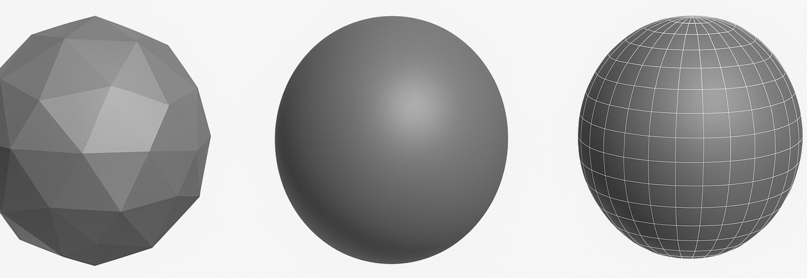
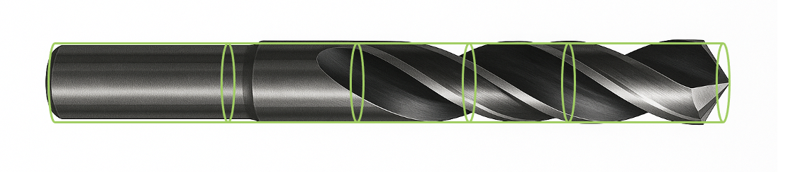
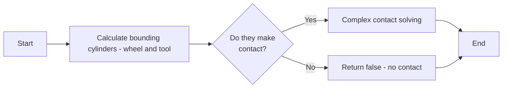

> “Premature optimization is the root of all evil.”
> — <cite>Donald Knuth</cite>

But as somebody who studied optimization and mathematics in university, optimization is literally one of my favorite topics.

My first job after graduating was working at a company which designed and manufactured CNC tool grinding machines as well as developing the software. I worked in the Application Software Engineering team. One component of the software was called the **Contact Solver**. This component was responsible for calculating when the grinding wheel would make contact with the geometry of the tool.

The actual real mathematical calculation of this was extremely complicated, as the surface of drill bits, mills etc can be highly complex. The mathematics is very complex, even with my background in Applied Mathematics at University I couldn't do a lot of the true 3D Calculations 😱

| **Contact Type**                  | **Formula (LaTeX)**                                                                                                                                 |
| --------------------------------- | --------------------------------------------------------------------------------------------------------------------------------------------------- |
| **Sphere–Sphere**                 | $$\text{contact} \iff \|c_2 - c_1\| \le r_1 + r_2$$                                                                                                 |
| **Sphere–AABB**                   | $$p = \operatorname{clamp}(c, m, M), \quad \text{contact} \iff \|p - c\| \le r$$                                                                    |
| **Capsule–Capsule**               | $$d = \operatorname{dist}([a_1, b_1], [a_2, b_2]), \quad \text{contact} \iff d \le r_1 + r_2$$                                                      |
| **Triangle–Triangle / Primitive** | $$\text{contact} \iff d_{\min} \le 0 \quad (\text{or } d_{\min} \le \varepsilon)$$                                                                  |
| **Separating Axis Theorem (SAT)** | $$\max_{a \in A} \langle a, \hat{n} \rangle < \min_{b \in B} \langle b, \hat{n} \rangle$$; $$\text{contact} \iff \text{no separating axis exists}$$ |
| ...                               | Many more complicated formulas                                                                                                                      |

One way I was in my manager manager's office at the time, and he complained that the Contact Solver was terrible for long tools, and solutions were taking too long.

> > Challenge Accepted 🦸‍♂️!

At this time in my life this was pre-children, and I used to have plenty of time to play games on PC, so I was into gaming, I even had spare money for a gaming Laptop! I had what I would say a vague interest in the gaming industry, but everything I heard about it sounded actually terrible to work in job-wise.

But I did take somewhat of an interest in Game engines, and had played around with running some on my machine myself. Game engines I would describe now in my world are opinionated frameworks that solve a problem common problems in the domain of making games:

| Domain             | Example Problems Solved                     |
| ------------------ | ------------------------------------------- |
| **Physics**        | Collision, contact solving, dynamics        |
| **Rendering**      | Lighting, shaders, culling                  |
| **Gameplay**       | ECS, AI, time, state                        |
| **Audio**          | Spatial sound, effects, streaming           |
| **Assets**         | Importing, streaming, memory                |
| **Networking**     | Sync, prediction, replay                    |
| **Tooling**        | Editors, profilers, visual scripting        |
| **Infrastructure** | Multithreading, serialization, localization |

And I was interested in the **Physics** part, having a background in mathematics at university. Whilst the mathematical problem of asking:

> Is there is contact between two objects? Or When do they intersect

Is a very **complex** one. An easier question can be to ask:

> Are these two objects **not** in contact?

Because that question can be easier to ask. I thought back to my high-level knowledge of game engines:

## Game Engine Optimizations

1. Firstly I knew in a game engine, that the first optimization game engines make are to break the map down into regions. When two object are not in the same region, they do not need to be checked if they are colliding.

2. Secondly, I knew that all game engines approximate shapes usually as **polygons**. Which can be simpler to detect collisions than on the real geometry. I also knew that more than likely these geometries were further approximated for this purpose.
   

## Applying these Optimizations

I then thought I will try and take some of these optimizations myself back into our solution. I hoped this would make things much faster. We had this sandbox application which showed the grinding wheel contacting the tool. It had a scroller which when moved, calculated where the wheel should be, and moved it there. Long tools in particular were extremely laggy, just like those video games I used to play when you had too much stuff in the scene.

## Approach

Although we did have polygon surfaces when we rendered the tool and our grinding wheel in 3D in our application, I thought to myself...

> Hey, both the tool, and the wheel could be put in inside a **Bounding Cylinder** instead of a **Bounding Box** or **Bounding Polygon**

Then I could ask the question: "Do these two cylinders make contact?

So the real algorithm becomes:

- Calculate Bounding Cylinders of wheel and Tool
- Check if they make contact?
- If yes then continue with complex contact solving
- If no then they don't make contact and `false` can be returned

I really liked this strategy as this was such a core important component, I could make very conservative optimizations that were more like sanity checks that these objects are not in contact. I used some Object Orientated techniques and added a method for each fundamental geometric object to calculate it's bounding cylinder. For examples we had an object which was a 2D surface rotated around an axis. I could calculate the largest radius, and the bound complex cylindrical geometries, which could then feed through the bounding cylinder check.

My final result had the tool divided up into many different cylindrical sections stitched together, to further minimize the bounding geometry to achieve what I regarded as the perfect balance between optimization and accuracy. The cylinders were a great geometry for these types of tools, with one cylinder potentially giving far more accuracy than millions of polygons.

## Summary

The results were fantastic! In our sandbox application, the wheel smoothly moved through the simulation. There was virtually no latency, even for very long tools.

1. This taught me a valuable lesson, that simple optimizations in highly complex calculations can yield extreme performance gains
2. Interest in random technology can give you great ideas
