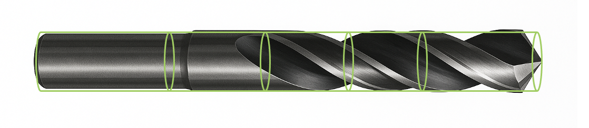

My first job after graduating was working at a company which designed and manufactured CNC tool grinding machines as well as developing the software. I worked in the Application Software Engineering team. One component of the software was called the **Contact Solver**. This component was responsible for calculating when the grinding wheel would make contact with the geometry of the tool.

The actual real mathematical calculation of this was extremely complicated, as the surface of drill bits, mills etc can be highly complex. The mathematics is very complex, even with my background in Applied Mathematics at University I couldn't do a lot of the true 3D Calculations 😱

| **Contact Type**                   | **Formula (LaTeX)**                                                                                                                                                                                                   |
| ---------------------------------- | --------------------------------------------------------------------------------------------------------------------------------------------------------------------------------------------------------------------- |
| **Sphere–Sphere**                  | $$\text{contact} \iff \|c_2 - c_1\| \le r_1 + r_2$$                                                                                                                                                                   |
| **Sphere–AABB**                    | $$p = \operatorname{clamp}(c, m, M), \quad \text{contact} \iff \|p - c\| \le r$$                                                                                                                                      |
| **Capsule–Capsule**                | $$d = \operatorname{dist}([a_1, b_1], [a_2, b_2]), \quad \text{contact} \iff d \le r_1 + r_2$$                                                                                                                        |
| **Triangle–Triangle / Primitive**  | $$\text{contact} \iff d_{\min} \le 0 \quad (\text{or } d_{\min} \le \varepsilon)$$                                                                                                                                    |
| **Separating Axis Theorem (SAT)**  | $$\max_{a \in A} \langle a, \hat{n} \rangle < \min_{b \in B} \langle b, \hat{n} \rangle$$; $$\text{contact} \iff \text{no separating axis exists}$$                                                                   |
| **GJK (Minkowski Difference)**     | $$A \ominus B = \{\, a - b \mid a \in A,\, b \in B \,\}$$; $$\operatorname{support}_{A \ominus B}(d) = \operatorname{support}_A(d) - \operatorname{support}_B(-d)$$; $$0 \in A \ominus B \Rightarrow \text{contact}$$ |
| **Signed Distance Field (SDF)**    | $$\min_{x \in \mathbb{R}^3}\big( \phi_A(x), \phi_B(x) \big) \le 0$$                                                                                                                                                   |
| **Continuous Collision (Spheres)** | $$\|v + u t\|^2 = (r_1 + r_2)^2, \quad v = c_2^0 - c_1^0, \quad u = v_2 - v_1, \quad t \in [0, 1]$$                                                                                                                   |
| **Continuous Collision (Convex)**  | $$\Delta t = \alpha \frac{d(t)}{v_{\text{rel, along normal}}}, \quad \text{advance until } d(t) \le \varepsilon \text{ or } t > 1$$                                                                                   |
| **Epsilon Tolerance**              | $$\text{contact if } d \le \varepsilon, \quad \varepsilon \in [10^{-6}, 10^{-4}] \times \text{bbox diagonal}$$                                                                                                        |
|                                    |

One way I was in my manager manager's office at the time, and he complained that the Contact Solver was terrible for long tools, and solutions were taking too long.

> > I thought this is a challenge I can take on and impress the socks off him 🧦🧦!

At this time in my life this was pre-children, and I used to have plenty of time to play games on PC, and I was into gaming, but didn't admit it. I had I'd say a vague interest in the gaming industry, but everything I heard about it sounded actually terrible to work in.

But I did take somewhat of an interest in Game engines. Game engines I would describe now in my world are opinionated frameworks that solve a problem common problems in a given industry, which may be:

| Domain         | Example Problems Solved              |
| -------------- | ------------------------------------ |
| **Physics**    | Collision, contact solving, dynamics |
| **Rendering**  | Lighting, shaders, culling           |
| ...            | ...                                  |
| **Networking** | Sync, prediction, replay             |

And I was interested in the **Physics** part, having a background in mathematics at university. Whilst the mathematical problem of asking

> Is there is contact between two objects?

Is a very **complex** one. An easy question can be to ask:

> Are these two objects **not** in contact?

Because that question can be easier to ask. I thought back to my high-level knowledge of game engines:

## Game Engine Optimizations

1. Firstly I knew in a game engine, that the first optimization game engines make are to break the map down into regions. When two object are not in the same region, they do not need to be checked if they are colliding.

2. Secondly, I knew that all game engines approximate shapes usually as **polygons**. Which can be simpler to detect collisions than on the real geometry. I also knew that more than likely these geometries were further approximated for this purpose.
   

## Applying these Optimizations

I then thought I will try and take some of these optimizations myself back into our solution. I hoped this would make things march faster. We had this sandbox application which showed the grinding wheel contacting the tool. It had a scroller which when moved, calculated where the wheel should be, and moved it there. Long tools in particular were extremely laggy, just like those video games I used to play when you had too much stuff in the scene.

## Approach

Although we did have polygon surfaces when we rendered the tool and our grinding wheel in 3D in our application, I thought to myself...

> Hey, both the tool, and the wheel could be put in inside a **Bounding Cylinder** instead of a **Bounding Box** or **Bounding Polygon**

Then I could ask the question: "Do these two cylinders make contact?

So the real algorithm becomes:

- Calculate Bounding Cylinders of wheel and Tool
- Check if they make contact?
- If yes then continue with complex contact solving
- If no then they don't make contact and `false` can be returned

I really liked this strategy as this was such a core important component, I could make very conservative optimizations that were more like sanity checks that these objects are not in contact. I used some Object Orientated techniques and added a method for each fundamental geometric object o calculate it's bounding cylinder. For examples we had an object which was a 2d surface rotated around an axis. I could calculate the largest radius, and the bound complex cylindrical geometries, which could then feed through the bounding cylinder check.

My final result had the tool divided up into many different cylindrical sections stitched together, to further minimize the bounding geometry to achieve what I regarded as the perfect balance between optimization and accuracy.

## Results & Reception

The **Results** were fantastic! In our sandbox application, the wheel smoothly moved through the simulation. There was virtually no latency, even for very long tools, I couldn't wait to show my manager!

**Reception** though was kind of lukewarm. He was sort of happy, and said something along the lines of:

> oh good

And that was it and went back to what he was doing, and other than another interaction I will talk about that was the only time I heard about it. Some while later I had an interaction with a very senior engineer everyone looked up to. He'd been at the company for decades had recently been honored by the CEO. He wanted me to undo my change. You see the easiest way I saw at the time for an entry point into my optimization in our code base was to use class casting in a part of the code base he didn't like. Looking back now, he was right, there was a better way to get my changes in. But at the time I reacted stubbornly. I expected him to appreciate my genius! And he didn't. Instead I left the changes in here convinced I was god's gift to software development.

Whilst for my own technical skills development this whole endeavour was great, professionally it was a flop:

- I didn't negotiate anything with my manager for being successful.
- I didn't take the negative feedback from the senior engineer well, and use the opportunity to make my work better
- I didn't sell myself and the work

**Summary:** Engineers cannot only add technical value, they have to also have professional skills. You could achieve the most amazing technical feat but you have to sell it and always get something out of your achievements.
