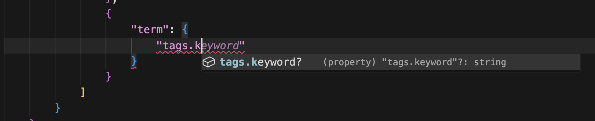
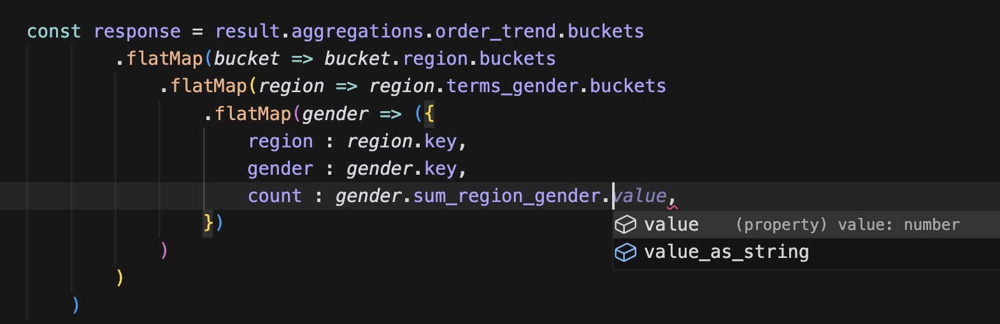

SQL! SQL is way better than Opensearch (OS) DSL you say? But not in all scenarios. Lets say you are writing code in typescript! My favourite language, mainly because it is the king of defining types:


- Template Literal Types
- Indexed / Lookup Types
- Conditional Types
- Distributive / Derived Conditional Types
- Intersection with Utility or Literal Types
- Mapped Types
- ...

You name it, there is a type for it. Because of all these great constructs, it is possible to create a type, which provides type-safety when writing opensearch queries. I should know, I've done it! I've written a library which achieves this: [opensearch-ts](https://www.npmjs.com/package/opensearch-ts).

This library works both in:
 1. Search/Query : Filtering Data
 2. Aggregations : Deriving Complex Statistics from Data

## Search

Firstly the old `WHERE` clause in SQL, there is `filter` in OS. (Although there are match/should/must etc as well)
Lets look at the example data you can load in OS, and look at the type [ServerLog](https://github.com/derrickfutschik/opensearch-ts/blob/main/src/tests/ServerLog.ts).

```typescript
export interface ServerLog {
    agent:     string;
    bytes:     number;
    clientip:  string;
    //...
```

Lets say you wanted to make a complicated query to find all the rows/documents that match a given query. If you did this in SQL in typescript you'd have some weird library going on, you definitely couldn't copy and paste the SQL in and have type-safety at the same time. OS DSL? Of course you can!

```typescript
import * as q from "opensearch-ts/search";

const searchExample: q.Search<ServerLog, {}> = {
  "index": INDEX_LOGS,
  "query": {
    "bool": {
      "must": [
        {
          "terms": {
            "agent.keyword": [
              "Mozilla/5.0 (X11; Linux x86_64; rv:6.0a1) Gecko/20110421 Firefox/6.0a1",
              "Mozilla/4.0 (compatible; MSIE 6.0; Windows NT 5.1; SV1; .NET CLR 1.1.4322)",
            ],
          },
        },
        {
          "range": {
            "@timestamp": {
              "lte": "2025-01-25T03:41:11.215Z",
              "gte": "2005-01-25T03:41:11.215Z",
            },
          },
        },
        {
          "term": {
            "tags.keyword": "login",
          },
        },
        {
          "term": {
            "tags.keyword": "success",
          },
        },
      ],
    },
  },
  "size": 10
}
```

Autocomplete and error high lighting all the way:



No more guessing field names, switching between the developer console and your IDE, now it's easier to write these queries in your IDE than using the console.

:::note
The `query` is exactly the way it is defined in the Opensearch Console
:::

## Aggregation

Ok now for the big finale. What about aggregations. I personally love the format of aggregations in OS. I can imagine the documents flowing into the nest buckets in the query you create. Whereas complicated `GROUP BY` and `SUM` in SQL would be mind-boggling.

Take this query:

```typescript
 {

        "agents": {
            "terms": {
                "field": "agent.keyword",
            },
            "aggs": {

                "maxValue": {
                    "max": {
                        "field": "@timestamp"
                    }
                },
                "maxHits": {
                    "top_hits": {
                        "size": 1,
                        "sort": [
                            {
                                "@timestamp": {
                                    "order": "desc"
                                }
                            }
                        ]
                    }
                },
                "minValue": {
                    "min": {
                        "field": "@timestamp"
                    }
                },
                "minHits": {
                    "top_hits": {
                        "size": 1,
                        "sort": [
                            {
                                "@timestamp": {
                                    "order": "asc"
                                }
                            }
                        ]
                    }
                }

            }
        }
    }
```

White according to ChatGPT translates to:

```sql
WITH ranked AS (
  SELECT
    agent,
    "@timestamp"        AS ts,
    l.*,
    ROW_NUMBER() OVER (PARTITION BY agent ORDER BY "@timestamp" DESC) AS rn_desc,
    ROW_NUMBER() OVER (PARTITION BY agent ORDER BY "@timestamp" ASC)  AS rn_asc
  FROM server_logs l
),
maxhit AS (
  SELECT agent, ts AS max_ts, row_to_json(ranked) AS max_hit
  FROM ranked
  WHERE rn_desc = 1
),
minhit AS (
  SELECT agent, ts AS min_ts, row_to_json(ranked) AS min_hit
  FROM ranked
  WHERE rn_asc = 1
)
SELECT
  m.agent,
  m.max_ts,
  m.max_hit,
  n.min_ts,
  n.min_hit
FROM maxhit m
JOIN minhit n USING (agent)
ORDER BY m.agent;
```

To be honest, I wouldn't be able to write that SQL query on my own, I have more of a JSON nested brain I guess. But so to does the Typescript compiler. With a bit of effort in describing the format of the output of your query, these agg queries can also be type-safe in both the query itself, and the response!

For example, what about a complicated query, looking at the seasonal trend of male vs female purchases by region. This can be modeled by the following type:

```typescript
type QuickExample = Search<Ecommerce,
{
    order_trend: {
        agg: "date_histogram",
        aggs: {
            "region": {
                agg: "terms",
                aggs: {
                    "sum_region": {
                        agg: "sum"
                    },
                    "terms_gender": {
                        agg: "terms",
                        aggs: {
                            "sum_region_gender": {
                                agg: "sum"
                            }
                        }
                    }
                }
            }
        }
    }
}>
```

Note that we haven't specified the exact query, or settings for the different type of aggs. For example:

- We don't know the time field for the `date_histogram`,
- We don't know the field which holds the `region` etc, it could be by shipping address or customer address
- We don't know the field holding the gender of the purchaser, maybe the recipient is used instead of purchaser

But none of this matters in the context of the type which is returned by this query.

The type of the response is then: `SearchResponse<Ecommerce, {...}>`. Which again provides deep nested autocomplete:

```typescript

const esClient = await makeClientWithEndpoint();
const tsClient: TypescriptOSProxyClient = new TypescriptOSProxyClient(esClient);
const result = await tsClient.searchTS({
  body: search,
  index: "opensearch_dashboards_sample_data_ecommerce",
});

const response = result.aggregations.order_trend.buckets.flatMap((bucket) =>
  bucket.region.buckets.flatMap((region) =>
    region.terms_gender.buckets.flatMap((gender) => ({
      region: region.key,
      gender: gender.key,
      count: gender.sum_region_gender,
    }))
  )
);
```

Again here you can see the autocomplete, even on the most nested objects:



## Summary

So I've proven it to you! There is no doubt, after the existence of this library, OS DSL is now the king!.... Ok well, maybe just maybe there is more to it than that, and obvousily OS DSL only exists in OS DSL, whereas SQL is everywhere. Still I put it that the developer experience is enhanced via type-safety. And because OS DSL is JSON at the end of the day this does have some benefits over SQL when defined in Typescript or other languages supports JSON or at least maps/dictionaries.
