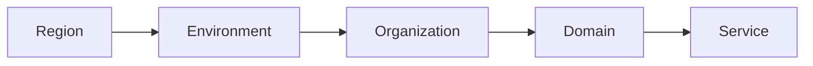

# Segregation and Naming Conventions

I've been meaning to make this guide, having worked at a SAAS from the very get-go, I've now got to live with some good and some bad decisions.

## Naming Resources

Segregate environments by account so that naming collisions are avoided, whilst reducing complexity by not adding unnecessary naming conventions to resources.
 By having the same name for a resource in different environments, it makes it easy to group resources across environments together. This is useful in filtering duplicates for security findings, as having different names for the same resources adds complexity to the queries needed 

:::tip
Strongly Recommend Naming Resources should be Agnostic of Environment
:::

Now especially that there are strong namespaces capabilities in Cloud Providers such as AWS, as well as strong support for multi-account setups, I recommend **NOT** including environment names in resource names, or even tags for that matter. An `Account` itself is a stronger way (than tagging) to group resources across an environment together, as an `Account` is an actual **container** for resources, and not just a **label**.

Operationally if `Deployment Instances` have different names, it can create severe complexity when trying to groups those instances together in different DevOps tools and products. I've experienced this first hand when sifting through findings in AWS Security Hub. Just when you find a way within a given tool to group these resources and solve this, as your organization grows and adopts new tools you find yourself being faced with this issue again and again for every tool you use.

:::note
Consider comparing 2 x Lambda functions `foobar`, in 2 different environments `dev` and `prod`.
If the Deployment Instances have different names, your query will need to have an OR clause to include both, `foobar-dev` or `foobar-prod` and then also have the group by environment anyway. Whereas if they have the same name, there is no need for a clause on the name. Excluding environment reduces the mental load in many different scenarios.
:::

## Segregation Strategy

Segregation needs to be done in a strategic way. Resources segregated differently can lead to drastically different outcomes. Following a consistent pattern for `Segregation and Naming Conventions` can lead ot many different benefits:
 - To avoid naming collisions
 - To reduce complexity by not adding unnecessary naming conventions to resources.
 - To make it easy to group resources across environments together. This is useful in filtering duplicates for security findings, as having different names for the same resources adds complexity to the queries needed 
 - Easier to automate as resources are easier to target across different environments as they are named in a predictable way.
 - Within an environment, segregating services and organizations sharing an environment increases your security posture, as the prefixes can be used to scope access to resources and create access boundaries

## Segregation Hierarchy    

## Key Naming Conventions

### Delimiters

| Naming Convention      | Priority  | Resource Type   | Delimiter | Word Delimiter | Description                                                                                                                         | Example                                |
|------------------------|-----------|-----------------|-----------|----------------|-------------------------------------------------------------------------------------------------------------------------------------|----------------------------------------|
| *hierarchical-case*    | 1         | Config Keys     | `/`       | `-`            | Hierarchical naming convention using a path-style namespace, useful for configuration keys.                                         | `/acme/store/checkout/api-key`         |
| *compound kebab-case*  | 2         | Resource IDs    | `--`      | `-`            | Used by AWS internally. Kebab-case is URL and code friendly; more acceptable than underscores for most services, especially for resource IDs.                | `acme--store--checkout--api-feature`   |

- Often `1` is not possible as a name (for example IAC solutions such as AWS Cloudformation)
- `-` is preferred over `_` as it is more URL friendly (can appear in the host name where as underscore cannot).
- `--` whilst this doesn't look the most pleasing to the eye, it is more URL friendly and distinguishes between the hierarchial delimiters and the word delimiters.
- other tools will not use `--` as a delimiter, so using it as a delimiter in the prefix for a key will not be compatible with other tools.

### Prefix Structure

If your configuration is **NOT** stored in the same namespace as the resource, you will have to have `{env}` in your naming conventions. It's challenging where to put `{env}`, as there are tradeoffs

| Segment | Example            | Description                                                                                                                             |
|---------|--------------------|-----------------------------------------------------------------------------------------------------------------------------------------|
| `{region}`     | ap-southeast-2               | *(Optional if platform will be multi-region)* The region of the deployment. This may be required if you are not going to segregate your regions by accounts, then there will be conflicts as some services are global (AWS IAM) or share the same namespace (such as S3 Buckets which must be unique across all regions). Deciding to have different accounts for different regions mitigates this issue, but this decision can sometimes be taking other factors into account than this guide. Note this region is the Availability Zone, and not the country itself. | 
| `{env}`   | dev                | *(Only if Required)* The deployment environment. Only required when the config key lives in a different namespace than the resource accessing it. If your config is stored in the same account or namespace as the resource, this segment is redundant and should be omitted. |
| `{org}`     | acme               | The top-level tenant or business unit. Provides hard namespace isolation. Chosen to be stable and long-lived—changes are rare and treated as a migration event. |
| `{domain}`  | payments           | A bounded business or technical capability that can be owned and reasoned about independently. More stable than a team name, more meaningful than a platform label. |
| `{service}` | checkout-api       | The concrete, deployable unit within a domain. Specific enough to be unambiguous, broad enough to own multiple configuration values beneath it. |
| `{key}`     | stripe-webhook-secret | The actual parameter being addressed. Everything above it is context and namespace; this is the value you are looking up.                     |

:::note
We will assume going forward there is only 1 region, so there is no need for segregation by region, but if there wasn't, region would need to be included in the prefix
:::

**Full example:**
 1. `/{org}/{domain}/{service}/{key}` => `/acme/payments/checkout-api/stripe-webhook-secret`
 2. `{org}--{domain}--{service}--{key}` => `acme--payments--checkout-api--stripe-webhook-secret`

# TODO Edge Cases

 1. Cross cutting secrets/config which do not belong to any one particular domain, service or organization.

## Rational for Convention

#### Every prefix is a meaningful operational boundary 

| Prefix | Meaning |
|--------|---------|
| `/acme/*` | Everything in the org | 
| `/acme/payments/*` | Everything owned by payments | 
| `/acme/payments/checkout-api/*` | Everything for a specific service |
| `/acme/payments/checkout-api/stripe-webhook-secret` | A specific value |

### Stability increases left to right
Each segment is chosen to be more volatile than the one to its left:

| Segment | Stability |
|---------|-----------|
| `{region}`  | for all intensive purposes will never change |
| `{org}`  | changes almost never, unless re-org |
| `{domain}` | changes rarely, capabilities outlive teams, only if domain is modelled differently and refactored |
| `{service}` | changes occasionally, deployable units get renamed, split or merged |
| `{key}` | changes most frequently |

### Global Services or Namespaces

Resource Type | region | org | domain | service | key |
|-------------|--------|-----|--------|---------|-----|
| AWS S3 | ✅ | ✅ | ✅ | ✅ | |
| AWS IAM | ✅ | ✅ | ✅ | ✅ | |
| SSM Parameters | | ✅ | ✅ | ✅ | ✅ |

## Each Component

### Region

### Org

### Domain

- Encodes business capability rather than org structure — capabilities are far more stable than teams or products over time
- Well understood in modern engineering culture thanks to DDD, Team Topologies, and microservices discourse
- Naturally guides correct usage — engineers intuitively know whether something belongs to payments or identity
- Aligns with how most mature orgs already think about their architecture, even if they don't use the word

### Service

## Key

