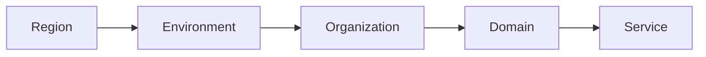

# Naming Conventions and Segregation

I've been meaning to make this guide, having worked at a SAAS from the very get-go, I've now got to live with some good and some bad decisions. It's been very hard to pinpoint why the naming conventions have lead to complexity. And overtime I realized that with engineering, you often make decisions based on the tradeoffs, but ultimately you do optimize for something. If you don't figure out what that something should be, you end having a solution which is not optimized for the problem you are trying to solve.

Living with a SAAS for many years now start to finish, what I ended up finding that these conventions are more important than I initially thought, and have ramifications in many different areas:

| Area           | Description                                                                                                      | Justification                                                                                                                                       |
|----------------|------------------------------------------------------------------------------------------------------------------|-----------------------------------------------------------------------------------------------------------------------------------------------------|
| *Cost*           | Ability to optimize, track, and control spend across environments, services, or resources.                       | Consistent naming and segregation make it easier to accurately allocate and monitor resource usage by environment, service, or team.                 |
| *Security*       | How easily you can enforce and audit security boundaries and practices.                                          | Segregation and clear naming provide obvious boundaries for applying Least Privilege, monitoring access, and investigating incidents.                |
| *Complexity*     | The overhead and cognitive load of understanding and managing environments and resources.                        | Predictable conventions reduce ambiguity and make it simpler for everyone to locate, manage, and reason about resources.                            |
| *Maintainability*| How straightforward it is to update, refactor, or scale your environments and naming conventions.                | Uniform conventions mean changes can be made systematically, minimizing the risk of errors and excessive rework.                                    |
| *Scalability*    | Ability to grow the number of services, accounts, or environments without hitting convention or collision issues.| Good conventions prevent collisions and manual workarounds as your organization and environments scale.                                              |
| *Usability*      | How easy naming and segregation is for engineers and consumers to work with daily.                               | Easy-to-understand resource names speed up onboarding and reduce misconfiguration by new and experienced engineers alike.                            |
| *Performance*    | Influence of structure/naming on ability to optimize for latency, throughput, or efficiency.                     | Logical segregation enables more effective resource grouping, which can positively impact locality, caching, or policy-based optimizations.           |
| *Reliability*    | Impact on operational stability, incident response, and minimizing blast radius of issues.                       | Separation by environment/service/domain helps contain failures and allows more targeted incident response.                                           |
| *Availability*   | Affect on uptime or redundancy due to naming/segregation conventions.                                            | Clear segregation facilitates independent deployments and failover, increasing uptime and resilience.                                                 |
| *Compliance*     | Helps enforce regulatory, audit, and governance requirements more easily.                                        | Accurate, well-segregated naming enables easier reporting, automated policy enforcement, and audit compliance.                                        |

These areas can all be condensed into the following guiding principals

# Guiding Principles

## 1. Naming Consistency Principle

**Definition:**  
A given resource should have the *same name* in every environment—whether it’s `dev`, `prod`, or any other. For example, a resource called `user-service` should be named `user-service` in all environments, rather than `user-service-dev` or `user-service-prod`.

**Why it matters:**  
Consistent resource names dramatically simplify the process of grouping, querying, and managing deployment instances across various tools and platforms. It helps reduce cognitive load and operational complexity, especially as your infrastructure grows.

---

## 2. Naming Stability Principle

**Definition:**  
Prioritize naming conventions that minimize how often resource names need to change over the lifetime of your systems. Choose prefixes or structures for your names that are unlikely to require revision as your organization and requirements evolve.

**Why it matters:**  
Stable naming reduces refactoring, lowers risk of errors, and leads to smoother automation and scaling. The fewer changes needed, the more reliable and maintainable your environment will be in the long run.
You'll also find that following this principal results in a better security posture, more on that later.

### Exceptions

:::note
Globally unique name, such as with an s3 bucket, it can be that another customer on AWS takes the name of an S3 bucket that you had planned. One solution to this is including a random id within the name. But in general I've found this scenario rare, and losing predictability in the name which can lead to negative outcomes
:::

:::note
Global services such as IAM which are global also may cause conflicts if you were to have more than 1 environment in an account **Prefer Account per Environment if Possible**
:::

# Segregation Strategy

Segregation needs to be done in a strategic way. Resources segregated differently can lead to drastically different outcomes. Following a consistent pattern for `Segregation and Naming Conventions` can lead ot many different benefits:
 - To avoid naming collisions
 - To reduce complexity by not adding unnecessary naming conventions to resources.
 - To make it easy to group resources across environments together. This is useful in filtering duplicates for security findings, as having different names for the same resources adds complexity to the queries needed 
 - Easier to automate as resources are easier to target across different environments as they are named in a predictable way.
 - Within an environment, segregating services and organizations sharing an environment increases your security posture, as the prefixes can be used to scope access to resources and create access boundaries

## Account Segregation

How you segregate your account will determine your name space, and therefore will affect your naming conventions. When creating accounts, modern patters would be to have 1 per region and environment, but there may be cases where you take a different approach again because of other factors related to: (*Cost&, *Compliance*, *Security*, etc).
But do challenge this decision if you do not segregate, as there is now especially strong multi-account support in Cloud Providers such as AWS.

> In general the more you segregate, the less likely you'll have naming collisions.

| Segment | Name | Description |
|---------|------|-------------|
| Region | `{region}` | If you don't segregate your Account by region, you will need to have `{region}` in the name of the resource to avoid collisions. |
| Environment | `{env}` | If you don't segregate your Account by environment, you will need to have `{env}` in the name of the resource to avoid collisions. |

:::tip
Operationally if `Deployment Instances` have different names, it can create severe complexity when trying to groups those instances together in different DevOps tools and products. I've experienced this first hand when sifting through findings in AWS Security Hub. Just when you find a way within a given tool to group these resources and solve this, as your organization grows and adopts new tools you find yourself being faced with this issue again and again for every tool you use.
:::

:::note
Consider comparing 2 x Lambda functions `foobar`, in 2 different environments `dev` and `prod`.
If the Deployment Instances have different names, your query will need to have an OR clause to include both, `foobar-dev` or `foobar-prod` and then also have the group by environment anyway. Whereas if they have the same name, there is no need for a clause on the name. Excluding environment reduces the mental load in many different scenarios.
:::

## Prefixing

### Segregation Hierarchy    

### Prefix Structure

If your configuration is **NOT** stored in the same namespace as the resource, you will have to have `{env}` in your naming conventions. It's challenging where to put `{env}`, as there are tradeoffs

It is sometimes said:

> Good architecture makes change easy. Bad architecture makes change hard.

Therefore in this decision we should optimize for making `Change Easy`, which would dictate the 

> stability should decrease left to right in a prefix

This guides us to pic the order as segments as follows:

| Segment | Stability |
|---------|-----------|
| `{region}`  | for all intensive purposes will never change |
| `{org}`  | changes almost never, unless re-org |
| `{domain}` | changes rarely, capabilities outlive teams, only if domain is modelled differently and refactored |
| `{service}` | changes occasionally, deployable units get renamed, split or merged |
| `{key}` | changes most frequently |

| Segment | Example            | Description                                                                                                                             |
|---------|--------------------|-----------------------------------------------------------------------------------------------------------------------------------------|
| `{region}`     | ap-southeast-2               | *(Optional if platform will be multi-region)* The region of the deployment. This may be required if you are not going to segregate your regions by accounts, then there will be conflicts as some services are global (AWS IAM) or share the same namespace (such as S3 Buckets which must be unique across all regions). Deciding to have different accounts for different regions mitigates this issue, but this decision can sometimes be taking other factors into account than this guide. Note this region is the Availability Zone, and not the country itself. | 
| `{env}`   | dev                | *(Only if Required)* The deployment environment. Only required in the prefix, when the config key lives in a different namespace than the resource accessing it. If your config is stored in the same account or namespace as the resource, this segment is redundant and should be omitted. However if a globally unique name is required, such as with an s3 bucket, this this will be required in the prefix.|
| `{org}`     | acme               | The top-level tenant or business unit. Provides hard namespace isolation. Chosen to be stable and long-lived—changes are rare and treated as a migration event. |
| `{domain}`  | payments           | A bounded business or technical capability that can be owned and reasoned about independently. More stable than a team name, more meaningful than a platform label. |
| `{service}` | checkout-api       | The concrete, deployable unit within a domain. Specific enough to be unambiguous, broad enough to own multiple configuration values beneath it. |
| `{key}`     | stripe-webhook-secret | The actual parameter being addressed. Everything above it is context and namespace; this is the value you are looking up.                     |

### Delimiters

Here are some possible candidates evaluated over different resource types.
You'll see that the `-` is most supported. `_` is a strong candidate but fails when it comes to host names and S3 bucket names.

**Possible Candidates for Delimiters:**
| Delimiter          | Hostname | AWS Stack Name (CloudFormation) | URL Path      | S3 Bucket Name               | Safe Across ALL? | Notes                                               |
| ------------------ | -------- | ------------------------------- | ------------- | ---------------------------- | ---------------- | --------------------------------------------------- |
| `-` hyphen         | ✅ Yes    | ✅ Yes                           | ✅ Yes         | ✅ Yes                        | ⭐ Yes (BEST)     | Universal standard. Recommended everywhere.         |
| `_` underscore     | ❌ No     | ✅ Yes                           | ✅ Yes         | ❌ No                         | ❌ No             | Breaks hostname and S3 bucket compatibility         |
| `.` dot            | ✅ Yes    | ✅ Yes                           | ✅ Yes         | ✅ Yes (with caveats)         | ⚠️ Conditional   | Breaks TLS wildcard matching, avoid in bucket names |
| `/` slash          | ❌ No     | ❌ No                            | ✅ Yes         | ❌ No (delimiter only in key) | ❌ No             | Only valid as URL path separator                    |
| space              | ❌ No     | ❌ No                            | ❌ Encoded     | ❌ No                         | ❌ No             | Never use                                           |
| `--` double hyphen | ✅ Yes    | ✅ Yes                           | ✅ Yes         | ✅ Yes                        | ⭐ Yes            | Common and safe variant                             |

There are different types of delimiters. Sometimes we are representing differences between the different segments of the prefix, other times we are representing differences between the different words with the same segment.
Therefore we need a delimiter for each case.
As `-` is the only supported delimiter for all resource types, including another is not ideal because it will reduce the resources types which can follow that convention. Instead the `--` is used to delimit between the different segments of the prefix, and a `-` is used to delimit between the different words with the same segment.

| Naming Convention      | Priority  | Resource Type   | Delimiter | Word Delimiter | Description                                                                                                                         | Example                                |
|------------------------|-----------|-----------------|-----------|----------------|-------------------------------------------------------------------------------------------------------------------------------------|----------------------------------------|
| *hierarchical-case*    | 1         | Config Keys     | `/`       | `-`            | Hierarchical naming convention using a path-style namespace, useful for configuration keys.                                         | `/acme/store/checkout/api-key`         |
| *compound kebab-case*  | 2         | Resource IDs    | `--`      | `-`            | Used by AWS internally. Kebab-case is URL and code friendly; more acceptable than underscores for most services, especially for resource IDs.                | `acme--store--checkout--api-feature`   |

- Often `1` is not possible as a name (for example IAC solutions such as AWS Cloudformation)
- `-` is preferred over `_` as it is more URL friendly (can appear in the host name where as underscore cannot).
- `--` whilst this doesn't look the most pleasing to the eye, it is more URL friendly and distinguishes between the hierarchial delimiters and word delimiters.
- other tools will not use `--` as a delimiter, so using it as a delimiter in the prefix for a key will not be compatible with other tools.

### Native Delimiters
:::note
If a resource already has native support for a delimiter, it should be used instead of the `--` delimiter, such as `/` in AWS S3, for storing objects. Otherwise you would lose functionality such as using the `prefix` to filter objects in a bucket.
:::

:::note
Another factor when deciding when to use a native delimiter, vs creating a new resource is 

An exception to this rule might be when you plan on centralizing data collection, and you want all data to be stored in a single location. You may want to pre-imptivlely segragate the data in each environment already, even though there will be only 1 segment, to symplify the sync operation.
:::

:::note
We will assume going forward there is only 1 region, so there is no need for segregation by region, but if there wasn't, region would need to be included in the prefix
:::

**Full example:**
 1. `/{org}/{domain}/{service}/{key}` => `/acme/payments/checkout-api/stripe-webhook-secret`
 2. `{org}--{domain}--{service}--{key}` => `acme--payments--checkout-api--stripe-webhook-secret`

# TODO Edge Cases

 1. Cross cutting secrets/config which do not belong to any one particular domain, service or organization.

## Rational for Convention

#### Every prefix is a meaningful operational boundary 

| Prefix | Meaning |
|--------|---------|
| `/acme/*` | Everything in the org | 
| `/acme/payments/*` | Everything owned by payments | 
| `/acme/payments/checkout-api/*` | Everything for a specific service |
| `/acme/payments/checkout-api/stripe-webhook-secret` | A specific value |

Resource Type | region | org | domain | service | key |
|-------------|--------|-----|--------|---------|-----|
| AWS S3 | ✅ | ✅ | ✅ | ✅ | |
| AWS IAM | ✅ | ✅ | ✅ | ✅ | |
| SSM Parameters | | ✅ | ✅ | ✅ | ✅ |

## Each Component

### Region

### Org

### Domain

- Encodes business capability rather than org structure — capabilities are far more stable than teams or products over time
- Well understood in modern engineering culture thanks to DDD, Team Topologies, and microservices discourse
- Naturally guides correct usage — engineers intuitively know whether something belongs to payments or identity
- Aligns with how most mature orgs already think about their architecture, even if they don't use the word

### Service

## Key

:::note
Optional: This principal, when dogmatically applied may mean that you segregate data in an environment, even when there will only be 1 segment, to simplify the sync operation to a central location later.
As the end destination will need to be segmented, but the source data not necessarily.
But by segregating the data in the source we achieve this principle.

This contradicts another principle in guiding how to segregate data, which would say if you only were going to have 1 segment, you should not segregate the data in the first place. But if you can see the future, and you know that you are going to combine data together, then you are best off already pre-paring for this scenario so it doesn't hit you later.
:::

## Tagging (Suggestions)

### Tagging Env
Many would argue that you need to tag every resource with what environment it lives in. I would argue that if you are segregating environments by accounts, then tags are redundant. Tagging resources would then violate the DRY Do Not Repeat Yourself principle, and add to overhead in needing more unnecessary tagging policies. Whilst it's fairly easy to tag resources you manage, sometimes tools or other entities manage resources in your account and it can be problematic to tag them.

`Account` itself is a stronger way (than tagging) to group resources across an environment together, as an `Account` is an actual **container** for resources, and not just a **label**. It's easier to make mistakes and not tag a resource for some amount of time, cause cost allocation calculations to be incorrect, whereas usage by `Account` is always accurate.

If there is some other need to tag resources, such as for security or compliance or because of a tool or service you are using.
Then have the `Account` the source of truth and perform batch tagging as needed. This will reduce the *Maintainability*.